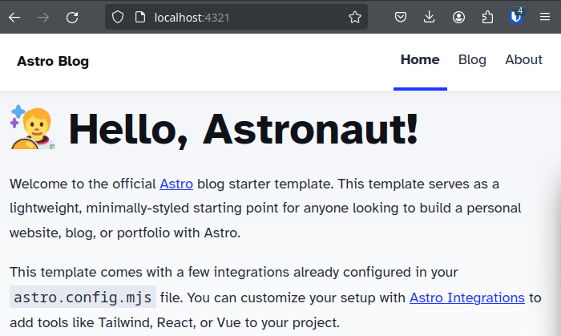

# Your own Blog on AWS - Tutorial

Today we are going to be creating our own blog on AWS hosted on S3 (AWS Simple Storage Service) and Cloudfront (a content delivery network).

Inside this folder we have a Javascript website using the web framework [Astro](https://astro.build). We have a simple blog template here for our use. In `src/content/blog` there are a few
blog examples that we can adjust with our own content. We also have pages we can edit in `src/pages/`. The main page of our site is located in `src/pages/index.astro` and looks like this:

```
<snip>
<h1>🧑 🚀 Hello, Astronaut!</h1>
			<p>
				Welcome to the official <a href="https://astro.build/">Astro</a> blog starter template. This
				template serves as a lightweight, minimally-styled starting point for anyone looking to build
				a personal website, blog, or portfolio with Astro.
			</p>
			<p>
				This template comes with a few integrations already configured in your
				<code>astro.config.mjs</code> file. You can customize your setup with
				<a href="https://astro.build/integrations">Astro Integrations</a> to add tools like Tailwind,
				React, or Vue to your project.
			</p>
<snip>
```

### Requirements for this Activity:

* an AWS Account w/Access Keys (if deploying from a laptop or VM not in AWS)
	* How to create AWS Access Keys: https://docs.aws.amazon.com/IAM/latest/UserGuide/id_credentials_access-keys.html
    *  How to login to AWS CLI with your new Keys: https://docs.aws.amazon.com/cli/latest/userguide/getting-started-quickstart.html 
	
*OR*

* an AWS Account w/Cloud9 IDE. -- How to spin up a Cloud9 IDE: https://docs.aws.amazon.com/cloud9/latest/user-guide/setup-express.html

⚠️ IF YOU ARE A CLOUD9 USER MAKE A NEW CLOUD9, do not use the Docker Cloud9. Delete that and create a new CLOUD9. ⚠️ 

⚠️ IF YOU ARE A CLOUD9 USER the only ports that will forward to the Cloud9 IDE are 8080, 8081, 8082. You must change the default listen port of Astro example:  ⚠️ 


#### We can put any valid HTML in this document and see it change by running the following command:

`bun install && bunx astro dev`

The output you get should look similar to this:


If your build was success you should be able to locally navigate to your site at [http://localhost:4321](http://localhost:4321)



Congrats, Astronaut! Make changes to `src/pages/index.astro` and `src/content/blog/` and watch your site change.

### Ready to Blast Off?

Once you have edited your main page and written a blog post or whatever you want to do, we can deploy our site to AWS. We will again be using [Serverless Stack](https://sst.dev) and the Bun NodeJS runtime is required. If you have not installed Bun in there are instructions in the `learning_lambda` directory of this repo. 

#### Time to Deploy:

Deploy to AWS by running the following command: `bunx sst deploy`. Your output may vary from the gif below, but if successful you will get a Cloudfront URL to access your site.


### Going Further:

You can add domain names, certificates, and more using the SST framework. If you would like to learn more about what SST can do for you please check out the following tutorial: [here](https://docs.sst.dev/start/astro).

# Astro Starter Kit: Blog

```sh
npm create astro@latest -- --template blog
```

[](https://stackblitz.com/github/withastro/astro/tree/latest/examples/blog)
[](https://codesandbox.io/p/sandbox/github/withastro/astro/tree/latest/examples/blog)
[](https://codespaces.new/withastro/astro?devcontainer_path=.devcontainer/blog/devcontainer.json)

> 🧑‍🚀 **Seasoned astronaut?** Delete this file. Have fun!


Features:

- ✅ Minimal styling (make it your own!)
- ✅ 100/100 Lighthouse performance
- ✅ SEO-friendly with canonical URLs and OpenGraph data
- ✅ Sitemap support
- ✅ RSS Feed support
- ✅ Markdown & MDX support

## 🚀 Project Structure

Inside of your Astro project, you'll see the following folders and files:

```text
├── public/
├── src/
│   ├── components/
│   ├── content/
│   ├── layouts/
│   └── pages/
├── astro.config.mjs
├── README.md
├── package.json
└── tsconfig.json
```

Astro looks for `.astro` or `.md` files in the `src/pages/` directory. Each page is exposed as a route based on its file name.

There's nothing special about `src/components/`, but that's where we like to put any Astro/React/Vue/Svelte/Preact components.

The `src/content/` directory contains "collections" of related Markdown and MDX documents. Use `getCollection()` to retrieve posts from `src/content/blog/`, and type-check your frontmatter using an optional schema. See [Astro's Content Collections docs](https://docs.astro.build/en/guides/content-collections/) to learn more.

Any static assets, like images, can be placed in the `public/` directory.

## 🧞 Commands

All commands are run from the root of the project, from a terminal:

| Command                   | Action                                           |
| :------------------------ | :----------------------------------------------- |
| `npm install`             | Installs dependencies                            |
| `npm run dev`             | Starts local dev server at `localhost:4321`      |
| `npm run build`           | Build your production site to `./dist/`          |
| `npm run preview`         | Preview your build locally, before deploying     |
| `npm run astro ...`       | Run CLI commands like `astro add`, `astro check` |
| `npm run astro -- --help` | Get help using the Astro CLI                     |

## 👀 Want to learn more?

Check out [our documentation](https://docs.astro.build) or jump into our [Discord server](https://astro.build/chat).

## Credit

This theme is based off of the lovely [Bear Blog](https://github.com/HermanMartinus/bearblog/).
