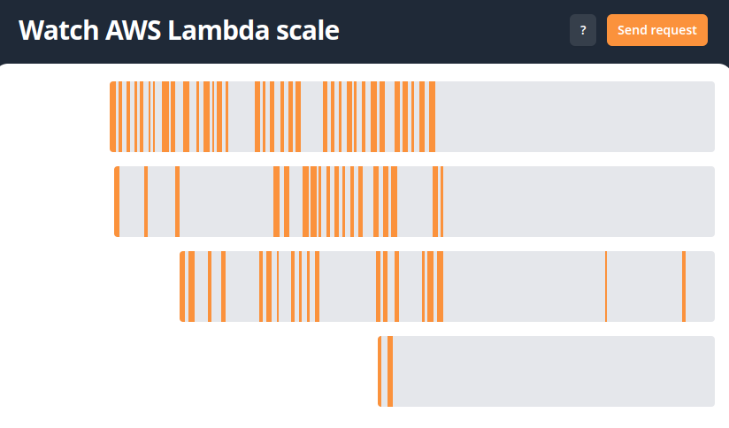
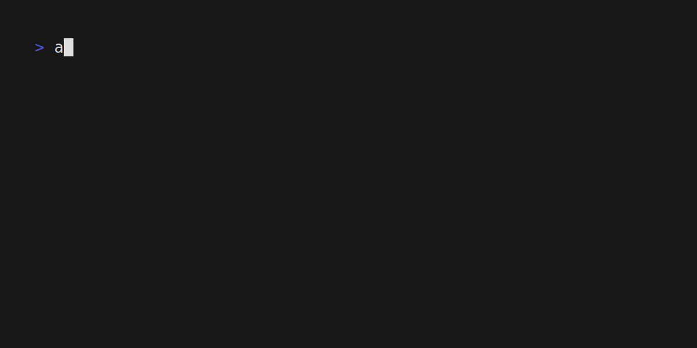
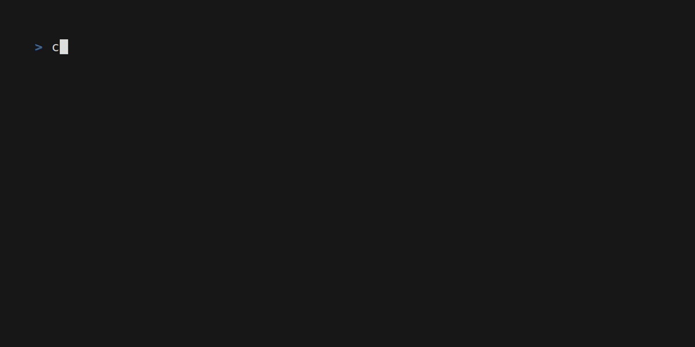

### Learn AWS Lambda

AWS Lambda is a serverless function / Function as a Service (FaaS) that can scale to tremendous usage. AWS Lambda, launched by Amazon Web Services in November 2014, marked a significant milestone in cloud computing by introducing a serverless computing service. This innovative platform allows developers to run code in response to events without the need to manage or provision servers, fundamentally changing the way applications are built and deployed. With Lambda, users only pay for the computing time consumed, making it a cost-effective solution for a wide range of computing tasks, from simple applications to complex, large-scale enterprise systems. Over the years, AWS Lambda has continuously evolved, adding support for numerous programming languages and integrating with various AWS services, thereby solidifying its position as a key component in the serverless computing landscape.

AWS Lambda's ability to scale is one of its most powerful features, offering seamless scalability to match the demand of the applications it hosts. Unlike traditional server-based architectures where scaling involves provisioning additional servers or instances, Lambda automatically adjusts the compute capacity by instantly spinning up as many instances of the function as needed to handle the rate of incoming requests. This auto-scaling capability ensures that applications remain highly available and responsive, regardless of the volume of requests. Furthermore, Lambda's stateless nature means each invocation of a function is independent, allowing for parallel execution and making it exceptionally well-suited for handling high-throughput, real-time workloads. This scalability feature, combined with its pay-per-use billing model, not only simplifies infrastructure management but also optimizes costs, as users only pay for the precise amount of compute time their applications consume.
#### AWS Lambda Activity: 
As a group everyone should navigate to this site and start invoking lambdas. You can see your requests and other visitors in real time display on the web page. 

https://watch-aws-lambda-scale.com/

I have also included a project to deploy your own lambda to your AWS account via a popular framework called Serverless Stack (SST) https://sst.dev. In the `learning_lambda` folder you will find some example lambdas written in Typescript (a subset of Javascript). Knowing how to read or write more code is not so important at this stage, but let's look at the example function located in *file*: `learning_lambda/packages/functions/src/lambda.ts`:

```
import { ApiHandler } from "sst/node/api";

export const handler = ApiHandler(async (_evt) => {
  return {
    statusCode: 200,
    body: `Hello world. The time is ${new Date().toISOString()}`,
  };
});
```

This is a very simple function that returns a message and the time as a string. We can edit any words on the `body:` line in between the string interpolation ticks, note that once the interpolation hit the `${new Data().toISOString()}` part that is actual Typescript code and should be changed with caution. This is an example below:

``this is my string I can edit ${This is my code that I cannot change without knowing what I am doing``}

If we wish to edit what our Lambda returns we can make an alteration like this:
*file*: `learning_lambda/packages/functions/src/lambda.ts`:

```
import { ApiHandler } from "sst/node/api";

export const handler = ApiHandler(async (_evt) => {
  return {
    statusCode: 200,
    body: `Hello world from JARED! I can add whatever text I want!!! Nobody can stop me MUAHAHAHA! The time is ${new Date().toISOString()}`,
  };
});
```

Once we are happy with how our code looks we can deploy it to AWS and call it. 

#### Requirements for this Activity:

* an AWS Account w/Access Keys (if deploying from a laptop or VM not in AWS)
	* How to create AWS Access Keys: https://docs.aws.amazon.com/IAM/latest/UserGuide/id_credentials_access-keys.html
	* How to login to AWS CLI with your new Keys: https://docs.aws.amazon.com/cli/latest/userguide/getting-started-quickstart.html
*OR*
* an AWS Account w/Cloud9 IDE. -- How to spin up a Cloud9 IDE: https://docs.aws.amazon.com/cloud9/latest/user-guide/setup-express.html

⚠️ IF YOU ARE A CLOUD9 USER MAKE A NEW CLOUD9, do not use the Docker Cloud9. Delete that and create a new CLOUD9. ⚠️

#### Steps to Deploy your Lambda:

1. From either your Cloud9 or VM you should be able to run the following command and see the output: `aws sts get-caller-identity`. Here is an example output. If your output does not look like this you need to revisit the AWS CLI authentication process mentioned above or deploy a Cloud9.

2. To use SST we have to install a NodeJS runtime environment. Today we will install Bun.sh (https://bun.sh) Here is the install command with an example output below:  `curl -fsSL https://bun.sh/install | bash

3. Once Bun is installed we have to run `bun install` inside the root of our `learning_lambda` folder. You will not be able to deploy SST resources without this.

4. Inside the same folder we need to run the following command: `bunx sst deploy`. Your output may look slightly different than mine, but if it is successful you will get an output of your APIs URL.

5. You can curl your endpoint or visit it in the browser to see the full output! Once you are done with the lab, you can use the command `bunx sst remove` to delete the resources your created.
